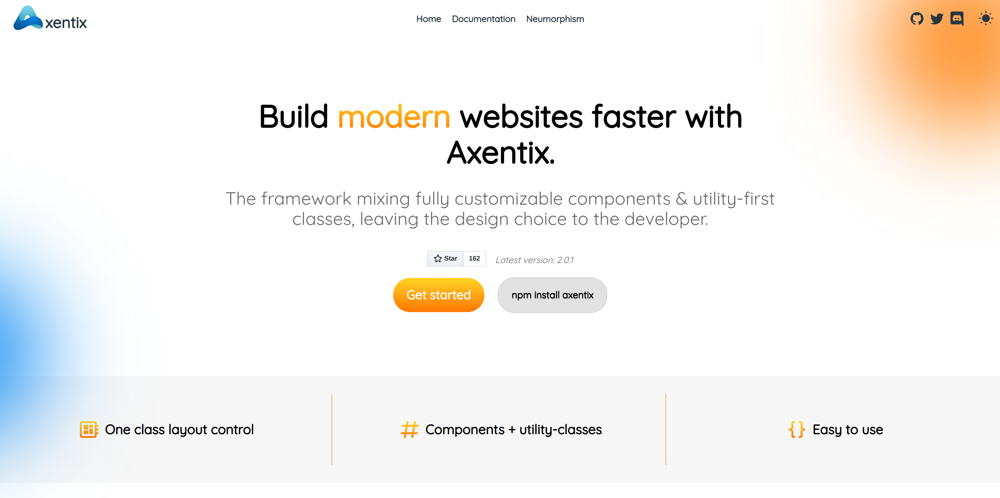

<p align="center">
  <a href="https://useaxentix.com/">
    
  </a>
</p>

<h3 align="center">Axentix - Front-end framework</h3>

<p align="center">
  <a href="https://useaxentix.com/?ref=github"><strong>Home</strong></a> |
  <a href="https://useaxentix.com/docs/?ref=github"><strong>Documentation</strong></a>
</p>

<br>

<p align="center">
  <a href="https://github.com/axentix/axentix/releases">
    
  </a>
  <a href="https://www.jsdelivr.com/package/npm/axentix">
    </img>
  </a>
  <a href="https://github.com/axentix/axentix/actions/workflows/tests.yml">
    </img>
  </a>
  <a href="https://sonarcloud.io/dashboard?id=axentix_axentix">
    
  </a>
  
  <a href="https://snyk.io/test/github/axentix/axentix?targetFile=package.json">
    
  </a>
  
</p>

<p align="center">
  <a href="https://discord.gg/8tgRDED">
    
  </a>
  <a href="https://openbase.com/js/axentix?utm_source=embedded&amp;utm_medium=badge&amp;utm_campaign=rate-badge">
    
  </a>
</p>

Axentix is a framework mixing fully customizable components & utility-first classes, leaving the design choice to the developer. 



## Why Axentix

- **Easy to custom** : Add your own color to the palette and its 9 variants will be generated. Every component comes with CSS Variables making you able to custom each of them.

- **Fast to learn, read and write** : You won't be lost between frameworks, Axentix's class names are easy to read, write and learn. If you already used Bootstrap or TailwindCSS, you already know a plenty of them.

- **Design choice to the developer** : The framework is focused on the developer experience and lets them choose their design by implementing easy to custom components & utility-first classes

- **Easiest grid system** : Axentix is the first framework using the css grid feature to create its grid system, making it the most advanced as easy to use grid system.

- **Themeable** : The integrated Theme Switcher handles natively dark mode and custom user theme. 

- **Google accessibility-friendly color palette** : The integrated color palette of **130+ colors** automatically generates lighten and darken variants. Setting them on any element will choose the best text-color depending on the google requirements.

- **Growing ecosystem** : Axentix comes with [its friends](https://github.com/axentix), Neu-Axentix implementing neumorphism design, a VSCode extension and its code snippets, Vue-Axentix and its VueJS components and more are incoming.

- **Zero dependencies** : No dependencies means freedom.

## Quickstart

### NPM
```
npm install axentix
```

### Yarn
```
yarn add axentix
```

### CDN

Include the files with [jsDelivr](https://www.jsdelivr.com/package/npm/axentix).

### Github Release  
You can download the latest release from [Github](https://github.com/axentix/axentix/releases/latest).

### Clone the repo
```
git clone https://github.com/axentix/axentix.git
cd axentix
npm ci
```

After installation you have access to our source files.  
You can build the project with `npm run build` or launch development server with `npm run dev`.

## Documentation

Find the documentation at [https://useaxentix.com/docs/](https://useaxentix.com/docs/?ref=github).

## Changelog

Changelog is accessible in the [CHANGELOG.md](CHANGELOG.md) file or in [the release section](https://github.com/axentix/axentix/releases).

## Sponsors

Support this project on [BuyMeACoffee](https://www.buymeacoffee.com/axentix) to become a sponsor and get **your logo on the docs** with a link to your website.

<div align="center">
  <a href="https://www.buymeacoffee.com/axentix" target="_blank"></a>
</div>

## Backers

Support this project on [BuyMeACoffee](https://www.buymeacoffee.com/axentix) to become a backer and get **your github profile here**.

[](https://github.com/Xelzs)
[](https://github.com/Stallos11)
[](https://axenthost.com)

## Creators

- Axel SIMONET - (Xelzs)  
  [Github](https://github.com/Xelzs)  
  [Linkedin](https://www.linkedin.com/in/axel-simonet/)  
  [Website](https://axelsimonet.fr/)
- Vincent LEVEQUE - (Stallos11)  
  [Github](https://github.com/Stallos11)  
  [Linkedin](https://www.linkedin.com/in/leveque-vincent/)

<br>

___

<p align="center">
Axentix Framework - Made with ❤️ by Axel SIMONET & Vincent LEVEQUE
</p>